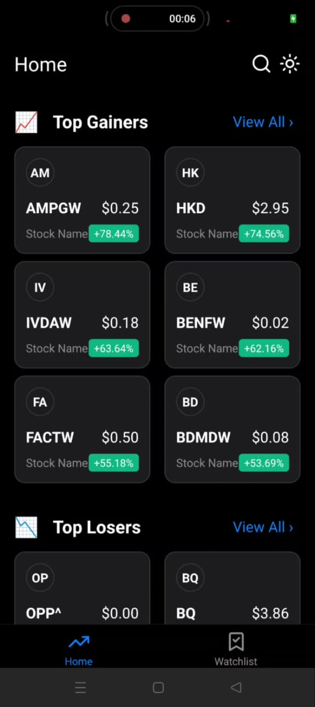
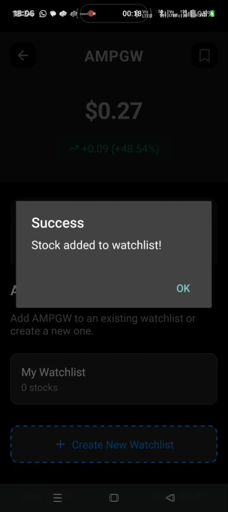
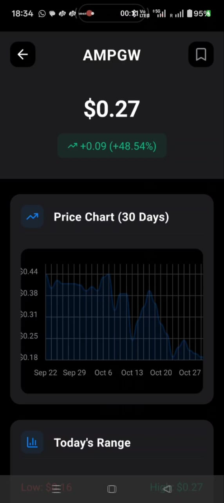
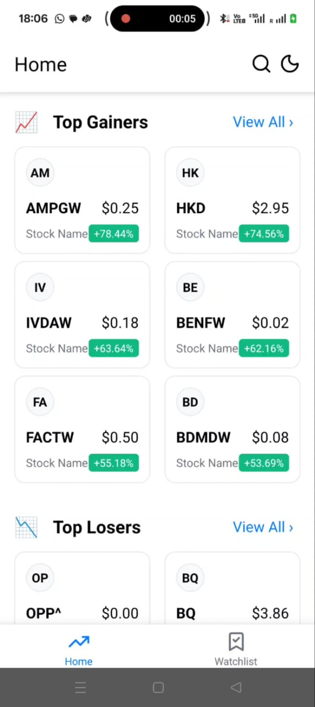
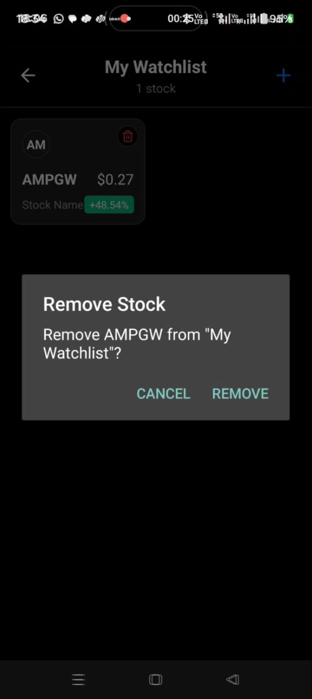
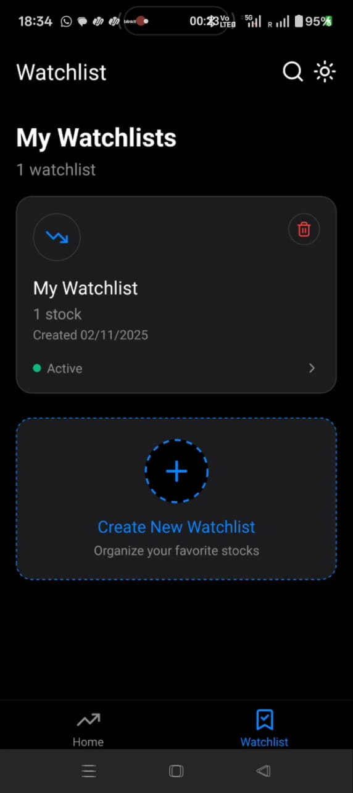

# Stock Market Tracker

A React Native application for tracking stock market data, managing watchlists, and viewing real-time stock information as per Growws frontend Assignment .I have implemented all the functionalities as well as some brownie features as mentinoned in the document.

Explore Screen: A page with Top Gainers and Losers section.
Each section contains a grid of cards that shows information about stocks/etfs.

Watchlist: A page where we show all watchlist lists. An empty state
should be there if no watchlist is present.

Product Screen: A page showing basic information of stocks/etfs and a line
graph of prices. Users can add / remove stocks to the watchlist from this
screen. The icon on this screen should be changed to show if stock has been
added to the watchlist.

Popup to add to watchlist: User can add a new watchlist name or
select existing watchlist to add the stock to watchlist. Use techniques to
save and show watchlist items from what the user has added to
watchlist from Stocks Details screen

View All Screen: A page with pagination where users can see all the list of
stocks under specific sections on explore. Should contain pagination if
needed.

## Screenshots

<p align="center">
  
  
  
  
</p>

<p align="center">
  
  
  
</p>

## Architecture


## Installation

### Prerequisites

- Node.js >= 20
- React Native development environment set up ([Setup Guide](https://reactnative.dev/docs/set-up-your-environment))
- For iOS: Xcode and CocoaPods
- For Android: Android Studio and JDK

### Steps

1. Clone the repository

```bash
git clone <repository-url>
cd Assignment
```

2. Install dependencies

```bash
npm install
```

3. Install iOS dependencies (macOS only)

```bash
cd ios
bundle install
bundle exec pod install
cd ..
```

4. Create environment file

```bash
# Create .env file in the root directory
echo "API_KEY=your_alpha_vantage_api_key" > .env
echo "BASE_URL=https://www.alphavantage.co/query" >> .env
```

5. Run the application

For iOS:

```bash
npm run ios
```

For Android:

```bash
npm run android
```

## React Hooks Used

### Built-in React Hooks

- **useState** - Managing component state (loading, data, errors, UI states)
- **useEffect** - Side effects (data fetching, subscriptions, cache synchronization)
- **useRef** - Persisting values across renders (timeout references, input refs)
- **useCallback** - Memoizing callback functions to prevent unnecessary re-renders
- **useContext** - Accessing global state from AppContext
- **useReducer** - Managing complex state logic in AppContext
- **useWindowDimensions** - Responsive layouts based on screen size

### Custom Hooks

#### useOfflineData

Manages offline data caching and network state monitoring.

**Features:**

- Monitors network connectivity using NetInfo
- Automatically loads cached data when offline
- Saves market data to AsyncStorage
- Provides loading states for cache operations

**Usage:**

```typescript
const { isOnline, isLoadingCache, saveCacheData, loadCachedData } =
  useOfflineData();
```

#### useAppContext

Custom hook to access global application state and dispatch actions.

**Usage:**

```typescript
const { state, dispatch } = useAppContext();
```

## Key Features

### Data Caching

- In-memory cache with 5-minute expiration for API responses
- AsyncStorage persistence for offline access
- Separate caching strategies for market data and user preferences
- Automatic cache invalidation and refresh

### Offline Support

- Network state monitoring with @react-native-community/netinfo
- Cached data available when offline
- Automatic data synchronization when connection restored
- Graceful degradation to mock data when API unavailable

### Error Handling

- Global error boundary component
- Per-screen error states with retry functionality
- Fallback to mock data on API failures
- User-friendly error messages

### Performance Optimizations

- Lazy image loading with loading states
- FlatList virtualization for large lists
- Memoized components and callbacks
- Rate limiting for API requests (5 requests per minute)
- Promise.allSettled for parallel data fetching
- Search debouncing (500ms delay) to reduce API calls
- Timeout-based debouncing implementation using useRef

### State Management

- Context API for global state
- Reducer pattern for predictable state updates
- Persistent storage for watchlists and theme preferences
- Automatic state synchronization with AsyncStorage

### Responsive Design

- Dynamic column layouts based on screen width
- Adaptive styling for tablets and phones
- Theme support (light/dark mode)
- Responsive typography and spacing

### API Integration

- Alpha Vantage API for real-time stock data
- Stock symbol search with debounced input
- Rate limiting and request throttling
- Automatic retry with exponential backoff
- Mock data fallback for development and demos

## Project Structure

```
Assignment/
├── src/
│   ├── app/              # Screen components
│   ├── components/       # Reusable UI components
│   ├── context/          # React Context providers
│   ├── hooks/            # Custom React hooks
│   ├── services/         # API and storage services
│   ├── types/            # TypeScript type definitions
│   └── constants/        # App constants and themes
```

## Technologies Used

### Core

- React Native
- TypeScript
- React Navigation (Native Stack Navigator)

### State Management

- React Context API
- useReducer for complex state logic

### Data & Storage

- AsyncStorage (persistent storage)
- NetInfo (network connectivity monitoring)
- In-memory caching with expiration

### UI & Styling

- Lucide React Native (icons)
- React Native Chart Kit (data visualization)
- Custom theming system (light/dark mode)
- Responsive design with useWindowDimensions

### Performance & Optimization

- Search debouncing (500ms)
- FlatList virtualization
- Memoization (useCallback, useMemo)
- Lazy image loading

### Error Handling

- React Error Boundary
- Custom error states with retry logic

### API

- Alpha Vantage API
- Stock quote and time series data
- Symbol search functionality
- Rate limiting (5 requests/minute)
